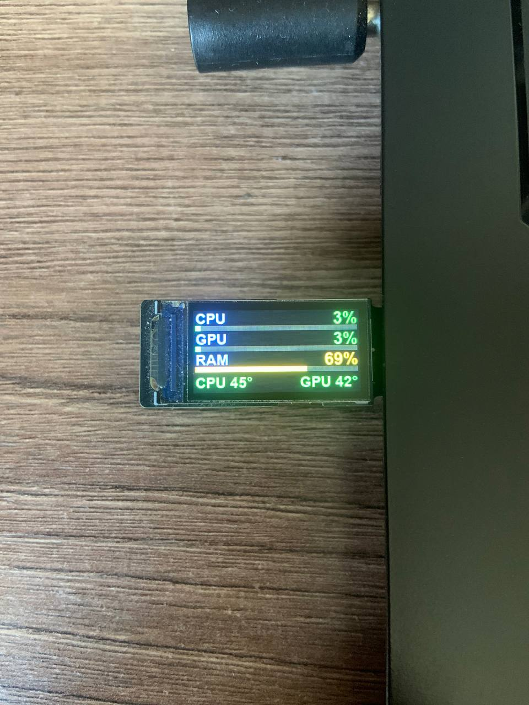
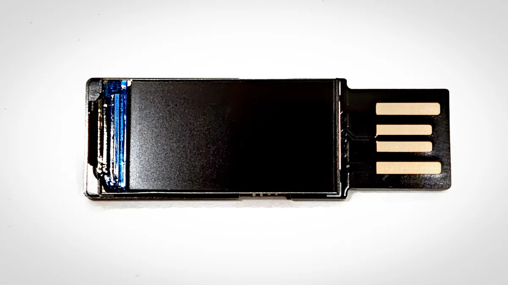

<div align="center">

# WeAct USB Mini System Monitor

**Live PC stats on a tiny WeAct Studio Display FS V1 0.96" USB screen — with zero third-party sensor apps.**

[](#)
[](#)
[](LICENSE)
[](#)

 

</div>

---

A ~4.5-second refresh loop shows what your PC is doing, right on the small bar display plugged into any USB port. Nothing to run on the display side — it speaks the stock WeAct protocol over a CH343 USB-UART bridge.

## What's on screen

| Metric | Displayed as | Color logic |
|---|---|---|
| **CPU load** | % + progress bar | green → yellow ≥ 60% → red ≥ 85% |
| **GPU load** | % + progress bar | same thresholds |
| **RAM usage** | % + progress bar | same thresholds |
| **CPU temperature** | ACPI thermal zone | yellow ≥ 65° → red ≥ 80° |
| **GPU temperature** | NVIDIA driver query | yellow ≥ 65° → red ≥ 80° |

## Key features

- **Auto port detection, protocol-verified** — no hardcoded `COM6`. The display is found by its CH343 bridge (VID `1A86` / PID `FE0C`, serial fallback `AD…`), and every candidate port must pass a firmware-version handshake before any rendering data is sent - so binary commands can never reach an unrelated device.
- **Hot-swap friendly** — unplug and re-plug at any time, into any USB port. The monitor polls ports every 3 s, re-initializes the display and keeps going. No script restarts, no device-manager digging.
- **Single-instance safe** — a named OS mutex guards against double launches (manual + autostart collision); the kernel releases it on any process death, so a stale lock can never block a fresh start.
- **Windows autostart, one click** — `weact_task_setup.cmd` self-elevates, locates `pythonw`, installs missing Python packages, creates a *Task Scheduler* job (`WeActMonitor`, runs at logon with admin rights) and starts it. Remove with `weact_task_remove.cmd`.
- **CPU temperature without third-party software** — real core DTS temperature via the bundled LibreHardwareMonitorLib library (loaded inside the script's process, no app running, no tray icons). Falls back to the native ACPI thermal zone where the library isn't available.
- **GPU stats from the driver** — utilization and temperature via `nvidia-smi`, no window flicker (`CREATE_NO_WINDOW`).
- **Portable, self-maintaining** — pid/log files are placed next to the script (`Path(__file__)`), machine-specific paths are nowhere in the code; the log is append-only with automatic size-based rotation.
- **Stock protocol, no custom firmware** — commands terminated by `0x0A`, pixels as RGB565 little-endian; one full-frame bitmap per update over 115200 baud.

## How it works

1. Render a 160×80 landscape frame with Pillow (labels, values, bars, temperatures).
2. Rotate it 90° in software and push it as a single full-frame bitmap into the panel's native 80×160 portrait buffer — the firmware's own orientation command proved unreliable, software rotation always lands.
3. Update loop ≈ 4.5 s: ~2.3 s frame transfer at 115200 baud + sampling + a pause. Higher baud rates pass the version handshake but the firmware drops bulk bitmap data, so 115200 it is.

## Requirements

- Windows 10/11
- Python 3.8+ with `pyserial`, `pillow`, `psutil`, `pythonnet` (the installer pulls them automatically)
- The `lib/` folder next to the script — it ships **LibreHardwareMonitorLib 0.9.4** (MPL-2.0), which provides the real CPU core temperature; newer LHM releases ship no embedded kernel driver and read nothing, so stick with 0.9.4
- NVIDIA GPU for the GPU lines (via `nvidia-smi` bundled with the driver). Without it CPU/RAM still work, GPU shows `n/a`
- The display itself: **WeAct Studio Display FS V1 0.96"** (CH343 USB chip; Win10/11 usually installs the driver itself, otherwise get [CH343SER.EXE](https://www.wch-ic.com/downloads/CH343SER_EXE.html))

## Quick install (Windows)

1. Copy the repo folder anywhere.
2. Right-click **`weact_task_setup.cmd`** → *Run as administrator*.
   The installer self-elevates, finds `pythonw`, installs missing packages, creates the autostart task and launches the monitor.
3. Plug the display in. Done.

<details>
<summary>Manual setup, without Task Scheduler</summary>

```bat
pip install pyserial pillow psutil
python weact_monitor.py          :: foreground run
```
For CPU temperature the process must be elevated (admin), otherwise it shows `CPU --`.
</details>

## Configuration

All constants live at the top of `weact_monitor.py`:

| What | Where | Default |
|---|---|---|
| Screen rotation | `ROT = Image.Transpose.ROTATE_270` | flip to `ROTATE_90` if the text is upside down |
| CPU temp calibration | `t -= 4` in `read_cpu_temp()` | ACPI zone reads a few °C above core DTS sensors; tune against your reference app |
| Pause between frames | `UPDATE_S = 1.0` | full cycle ≈ 4.5 s |
| Brightness | byte `178` in `init_display()` | 0–255 |

## Troubleshooting

| Symptom | Fix |
|---|---|
| `CPU --` | Not elevated (Task Scheduler task required), or the LHM library failed to load — check `weact_monitor.log` |
| CPU temp stuck at a constant | The ACPI fallback is active and this board never updates its thermal zone; make sure `lib\` is next to the script and the task runs elevated, so the real DTS readout is used |
| GPU shows `n/a` | No NVIDIA GPU / `nvidia-smi` not in PATH |
| Screen stays black after replug | Firmware can get stuck; unplug-replug the USB once, the next frame repaints it |
| Exits right after start with `another instance is running` in the log | The single-instance mutex found a running copy — stop it first (`taskkill /F /PID` from `weact_monitor.pid`) |
| Text upside down | Switch `ROT` to `ROTATE_90` |
| COM port never appears | Install the CH343 driver (link above) |

## Русский / Русский раздел

**Живая статистика ПК на мини-дисплее WeAct Studio Display FS V1 0.96"** — загрузка CPU / GPU / RAM с цветными барами (жёлтый от 60%, красный от 85%) и температуры CPU / GPU (жёлтая от 65°, красная от 80°). Обновление раз в ~4.5 с.

**Ключевые возможности:**
- **Автоопределение порта с проверкой протокола** — дисплей ищется по VID/PID чипа CH343 (`1A86`/`FE0C`), COM-порт нигде не захардкожен; каждый порт-кандидат обязан ответить на рукопожатие (запрос версии прошивки), прежде чем ему уйдут данные — чужое устройство не получит бинарные команды.
- **Горячая замена** — переткнуть в любой USB-порт можно в любой момент: монитор раз в 3 с опрашивает порты и сам продолжает работу, без перезапуска скрипта.
- **Защита от двойного запуска** — именованный мьютекс ОС: ядро снимает его при любой смерти процесса, поэтому «мёртвая» блокировка никогда не помешает свежему запуску.
- **Автозапуск Windows в один клик** — `weact_task_setup.cmd` (запуск от администратора) сам найдёт pythonw, поставит pip-пакеты, создаст задачу планировщика **WeActMonitor** (при входе в систему, с правами админа — они нужны для температуры CPU) и запустит её. Удаление — `weact_task_remove.cmd`.
- **Температура CPU без сторонних программ** — настоящая температура ядер через встроенную библиотеку [LibreHardwareMonitorLib](https://github.com/LibreHardwareMonitor/LibreHardwareMonitor) (грузится внутри процесса скрипта, никакого приложения и трея); фолбэк — системная ACPI-теплозона.
- **Статистика GPU из драйвера** — `nvidia-smi` без мелькающих окон.
- **Переносимость и самообслуживание** — pid/лог лежат рядом со скриптом, машинных путей в коде нет; лог пишется в режиме добавления с автоматической ротацией по размеру.

**Установка:** скопировать папку → правый клик по `weact_task_setup.cmd` → «Запуск от имени администратора» → вставить дисплей в USB. Зависимости ставятся автоматически (`pip install pyserial pillow psutil`).

**Настройки:** поворот — `ROT` (`ROTATE_90`, если текст вверх ногами); калибровка температуры — `t -= 4`; яркость — байт в `init_display()`.

**Если что-то не так:** `CPU --` — нет прав администратора или библиотека не загрузилась (см. `weact_monitor.log`); температура CPU застыла на одном числе — работает ACPI-фолбэк, а настоящая температура требует папки `lib\` рядом со скриптом и повышенной задачи; монитор сразу выходит с записью «another instance is running» в логе — уже работает вторая копия, сначала остановите её (`taskkill /F /PID` из `weact_monitor.pid`); `GPU n/a` — нет NVIDIA; экран чёрный после переткновения — передёрнуть USB ещё раз; COM-порта нет — поставить драйвер CH343.

## Credits & related

- Protocol reference: [WeActStudio/WeActStudio.SystemMonitor](https://github.com/WeActStudio/WeActStudio.SystemMonitor) (imported into [turing-smart-screen-python](https://github.com/mathoudebine/turing-smart-screen-python))
- Theming ecosystem for these displays: [turing-smart-screen-python](https://github.com/mathoudebine/turing-smart-screen-python), [WeAct4HA](https://github.com/rossi75/WeAct4HA)

## License

[MIT](LICENSE) © 2026 xISPx
